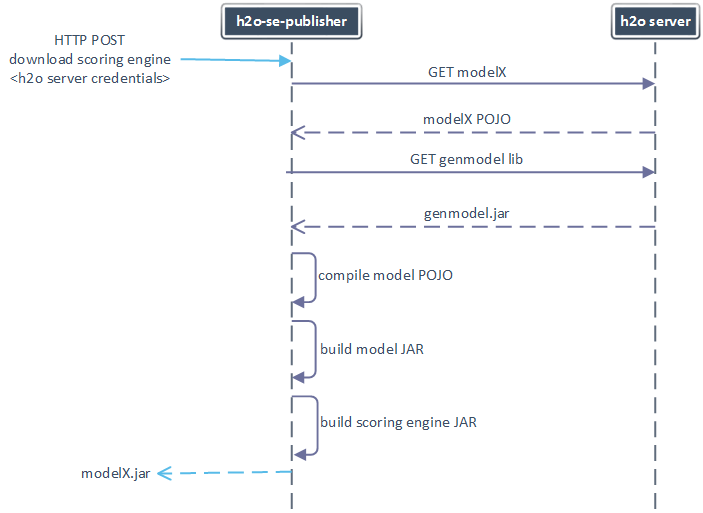
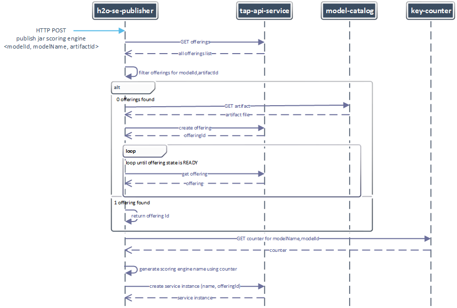

[](https://www.versioneye.com/user/projects/572367feba37ce00350af6cb)

# h2o-scoring-engine-publisher

An application with a RESTful interface that builds H2O scoring engine and exposes it as a JAR file for downloading or publishes a model from model-catalog as an instance of scoring engine on TAP.

## Required services
h2o-scoring-engine-publisher requires following dependencies to run on TAP:
* sso config map containing tokenUri, clientId and clientSecret to be able to communicate with OAuth2 secured components 
* model-catalog to fetch scoring engine file to instantiate
* tap-api-service to perform instantiating operation 
* key-counter component to be used for scoring engine name generation

## How to build
h2o-scoring-engine-publisher is a spring-boot application build by maven. A command to compile, run tests and build:
```
$ mvn package
```

## How to run locally
To run the service locally define following environment variables:

* `API_SERVICE_HOST` - TAP api url, typically `http://api.<tap-domain>`
* `API_SERVICE_TOKEN_URI` - a token URI providing tokens to be used in communication with tap-api-service, typically `http://uaa.<tap-domain>/oauth/token`
* `API_SERVICE_CLIENT_ID` - an OAuth2 clientId used to obtain token for communication with tap-api-service
* `API_SERVICE_CLIENT_SECRET` - an OAuth2 clientSecret to obtain token for communication with tap-api-service
* `MODEL_CATALOG_URL` - a url to model-catalog component
* `MODEL_CATALOG_TOKEN_URI` - a token URI providing tokens to be used in communication with model-catalog, typically `http://uaa.<tap-domain>/oauth/token`
* `MODEL_CATALOG_CLIENT_ID` - an OAuth2 clientId used to obtain token for communication with model-catalog
* `MODEL_CATALOG_CLIENT_SECRET` - an OAuth2 clientSecret to obtain token for communication with model-catalog
* `KEY_COUNTER_HOST` - a url to key-counter component
* `KEY_COUNTER_USER` - a username for communication with BasicAuth secured key-counter
* `KEY_COUNTER_PASSWORD` - a password for communication with BasicAuth secured key-counter

and run service:
```
java -jar h2o-scoring-engine-publisher-x.y.z.jar
```

## How to use
h2o-scoring-engine-publisher provides REST API

### Publish scoring engine as an instance in TAP

**URL**: `http://<application-host>/api/v1/scoring-engine/jar-scoring-engine`

**Headers**: `Content-type: application/json`

**HTTP Method**: `POST`

**Request body**: 
```
{  
  "modelId":"<id-of-the-model-from-model-catalog>",
  "artifactId":"<id-of-the-model-artifact-containing-scoring-engine>",
  "modelName":"<the-name-of-the-model-in-model-catalog>"
}
```
### Download scoring engine as a JAR file
**URL**: `http://<application-host>/api/v1/engines/<model-name>/downloads`

**HTTP Method**: `POST`

**Request body**: 
```
host=<h2o server host>&username=<h2o server username>&password=<h2o server password>
```

##Request flow
### Downloading scoring engine


###Publishing scoring engine



